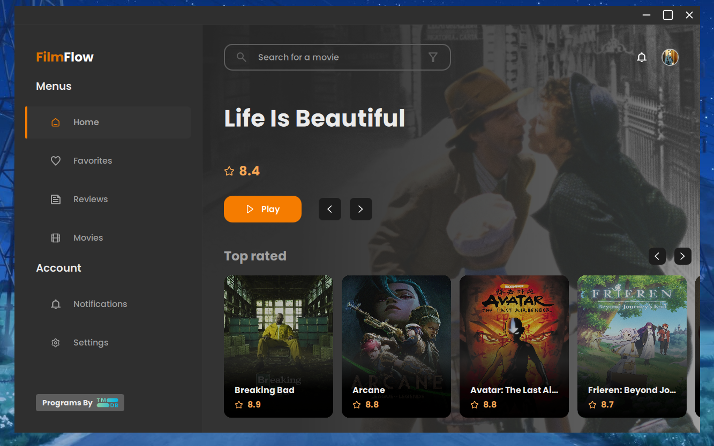
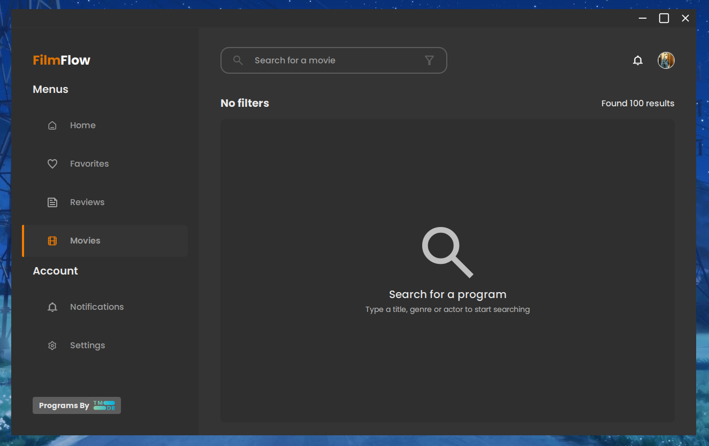
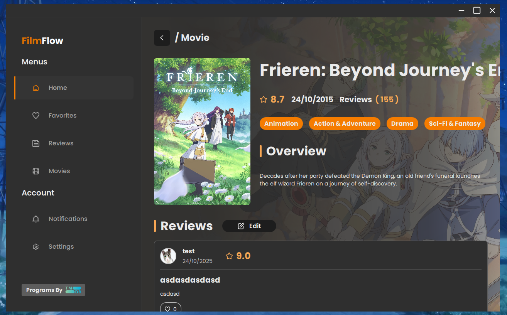
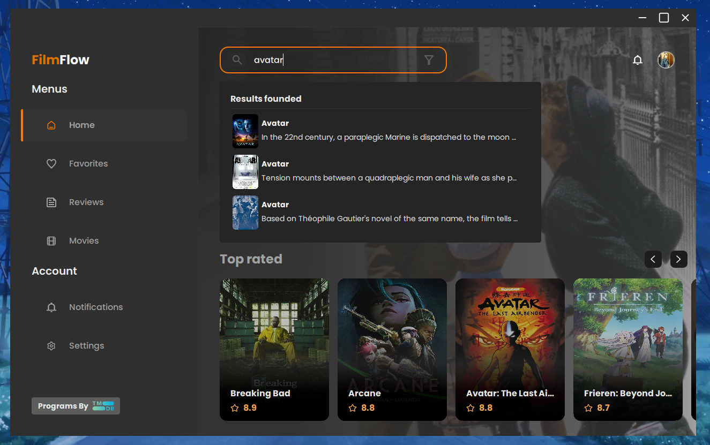
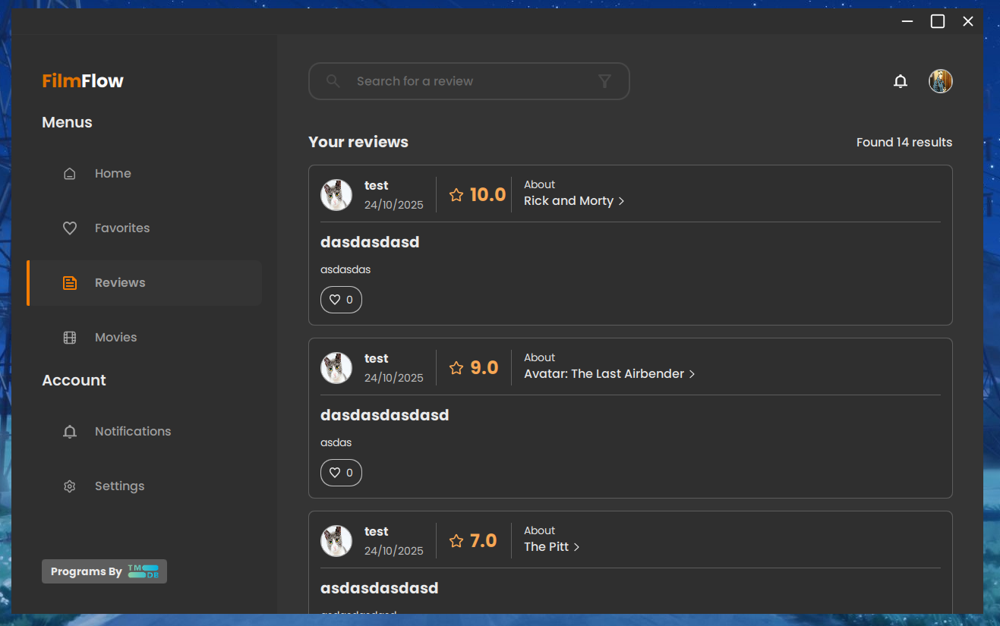
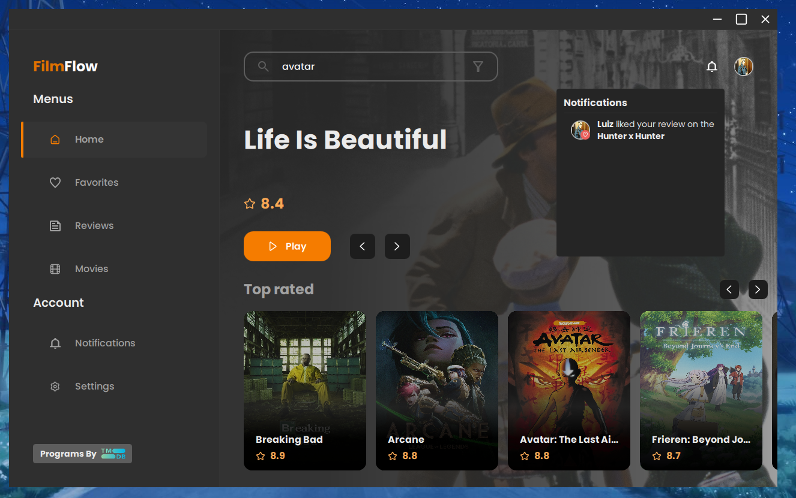
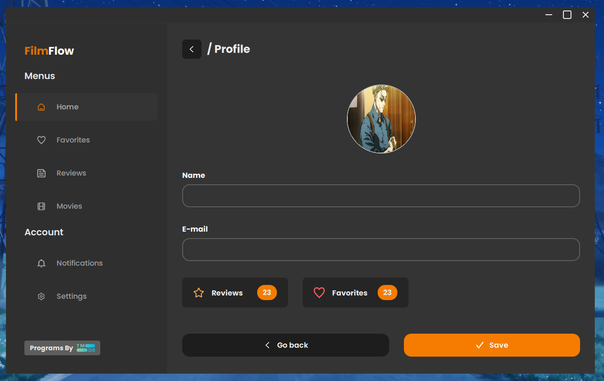
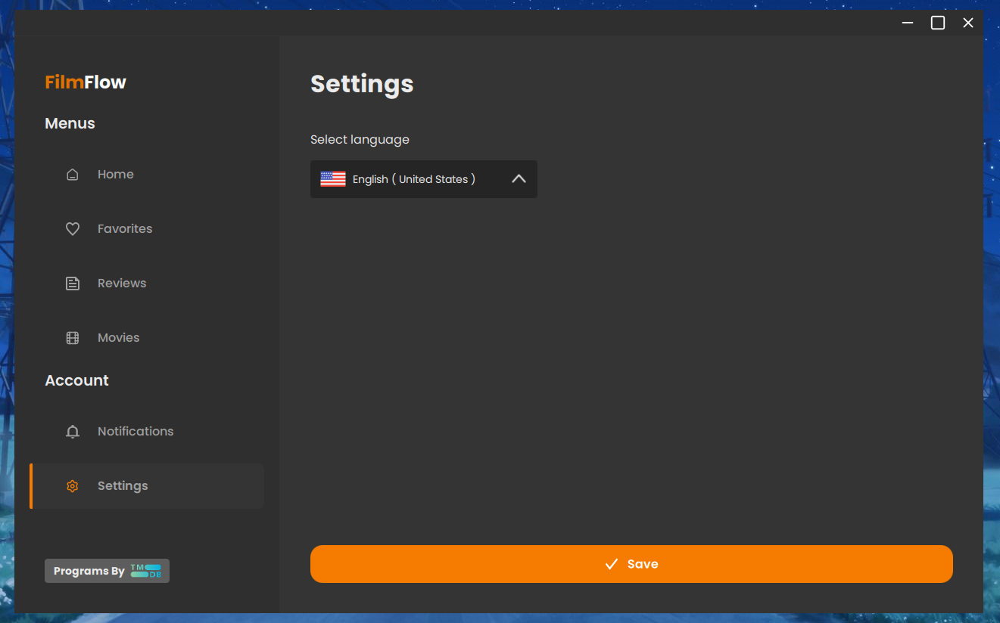

# Film Flow UI

Uma aplicação desktop moderna e elegante para gerenciamento e descoberta de filmes, desenvolvida com Qt/QML. O Film Flow UI oferece uma interface intuitiva para explorar filmes, ler e escrever avaliações, gerenciar favoritos e muito mais.

## Sobre o Projeto

Film Flow UI é uma aplicação multiplataforma construída com Qt 6.5 e QML, proporcionando uma experiência de usuário fluida e responsiva. A aplicação apresenta uma arquitetura modular com separação clara entre lógica de negócio (C++), controles e interface (QML).

## Funcionalidades

- **Tela Inicial**: Visualize filmes em destaque e recomendações personalizadas
- **Catálogo de Filmes**: Explore uma vasta coleção de filmes organizados por categorias
- **Busca Avançada**: Encontre filmes rapidamente com sistema de busca inteligente
- **Avaliações**: Leia e escreva avaliações detalhadas sobre filmes
- **Notificações**: Receba atualizações sobre novos filmes e interações
- **Perfil**: Gerencie seu perfil e preferências pessoais
- **Configurações**: Personalize a aplicação conforme suas necessidades
- **Favoritos**: Salve seus filmes favoritos para acesso rápido

## Tecnologias

- **Qt 6.5+**: Framework multiplataforma
- **QML/Qt Quick**: Interface declarativa e moderna
- **C++17**: Lógica de negócio e performance
- **CMake**: Sistema de build
- **Qt Quick Controls 2**: Componentes de UI modernos

## Requisitos

- CMake 3.16 ou superior
- Qt 6.5 ou superior
- Compilador C++17 compatível
- Componentes Qt necessários:
  - Qt6::Quick
  - Qt6::QuickControls2
  - Qt6::Qml
  - Qt6::LinguistTools

## Estrutura do Projeto

```
film-flow-ui/
├── core/              # Lógica de negócio e entidades
│   ├── controller/    # Controladores de API
│   ├── entities/      # Modelos de dados
│   ├── manager/       # Gerenciadores de aplicação
│   ├── network/       # Camada de rede
│   └── validator/     # Validadores
├── controls/          # Controles QML (C++)
├── ui/
│   ├── Components/    # Componentes reutilizáveis QML
│   ├── Screens/       # Telas da aplicação
│   ├── Theme/         # Tema e recursos visuais
│   └── Models/        # Modelos QML
├── documentation/     # Imagens de documentação
├── fonts/            # Fontes personalizadas
└── resources/        # Recursos estáticos
```

## Capturas de Tela

### Tela Inicial (Home)
A tela inicial apresenta filmes em destaque, recomendações personalizadas e acesso rápido às principais funcionalidades.



### Catálogo de Filmes
Explore uma vasta coleção de filmes organizados por gênero, popularidade e outros critérios.



### Detalhes do Filme
Visualize informações detalhadas sobre cada filme, incluindo sinopse, elenco, avaliações e muito mais.



### Busca
Sistema de busca avançado que permite encontrar filmes rapidamente por título, gênero ou outros critérios.



### Avaliações
Leia avaliações de outros usuários e compartilhe suas próprias opiniões sobre os filmes.



### Notificações
Mantenha-se atualizado com notificações sobre novos filmes, interações e atualizações importantes.



### Perfil
Gerencie suas informações pessoais, preferências e histórico de atividades.



### Configurações
Personalize a aplicação de acordo com suas preferências, incluindo idioma, tema e outras opções.



## Internacionalização

A aplicação suporta múltiplos idiomas:
- Português (pt_BR)
- Inglês (en_US)
- Espanhol (es_ES)

**Desenvolvido usando Qt/QML**

