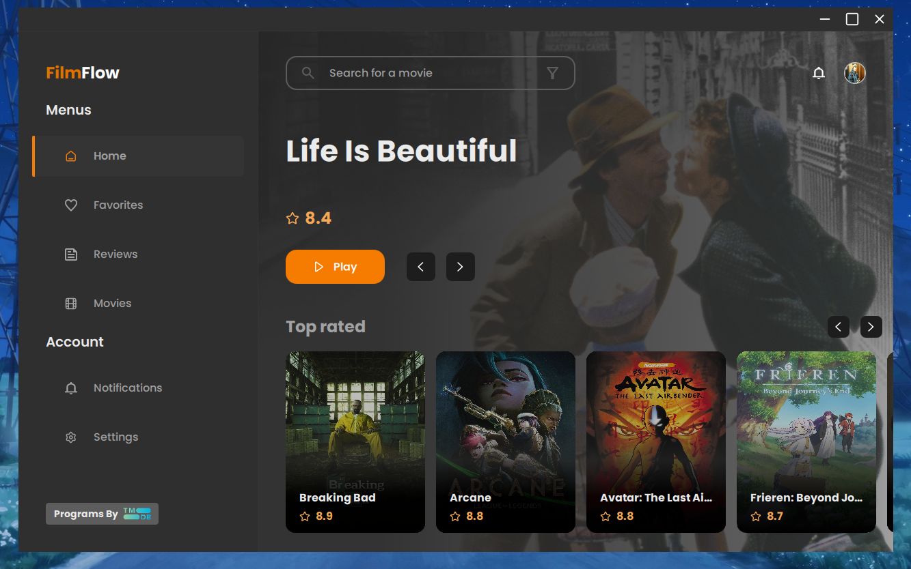
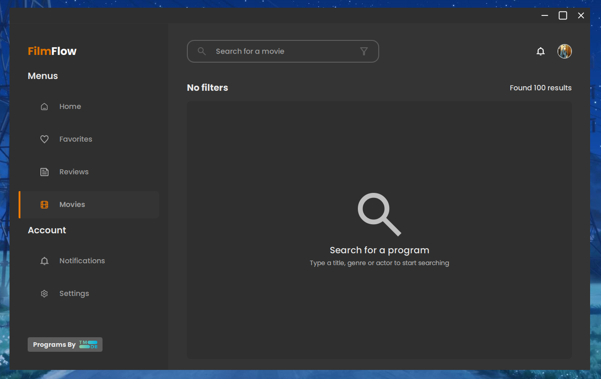
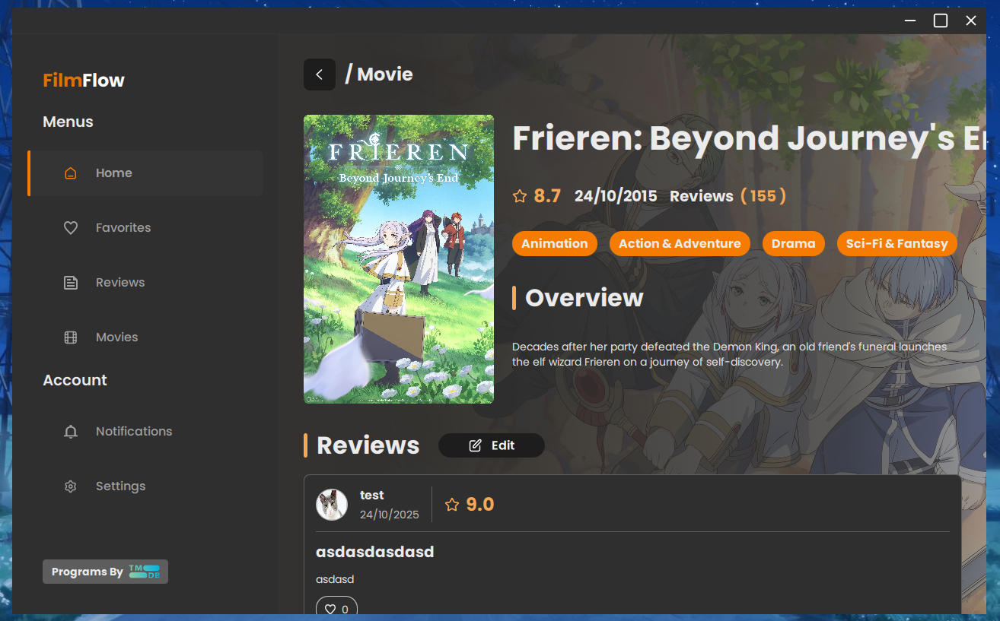
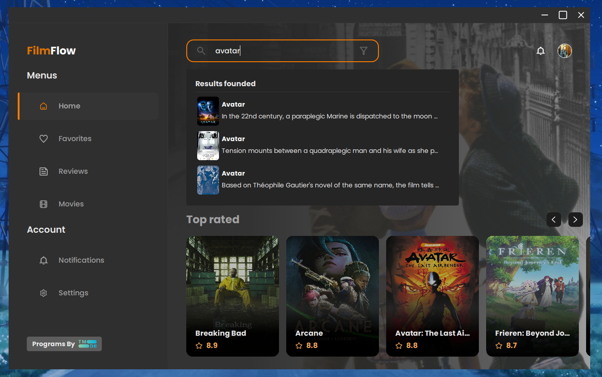
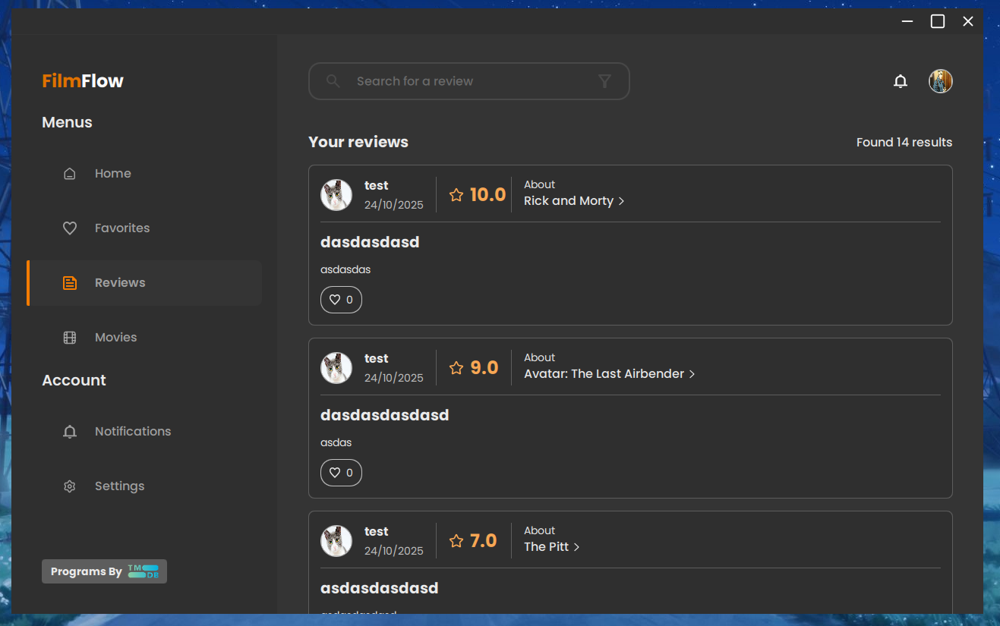
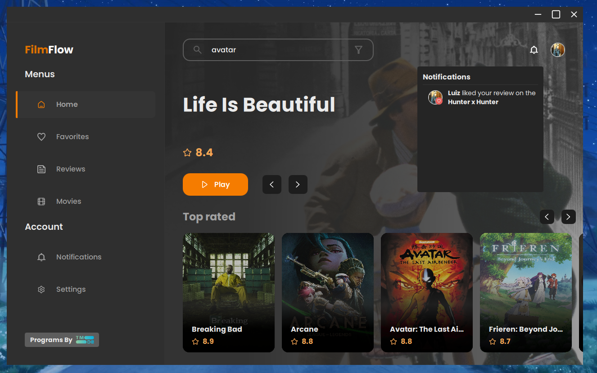
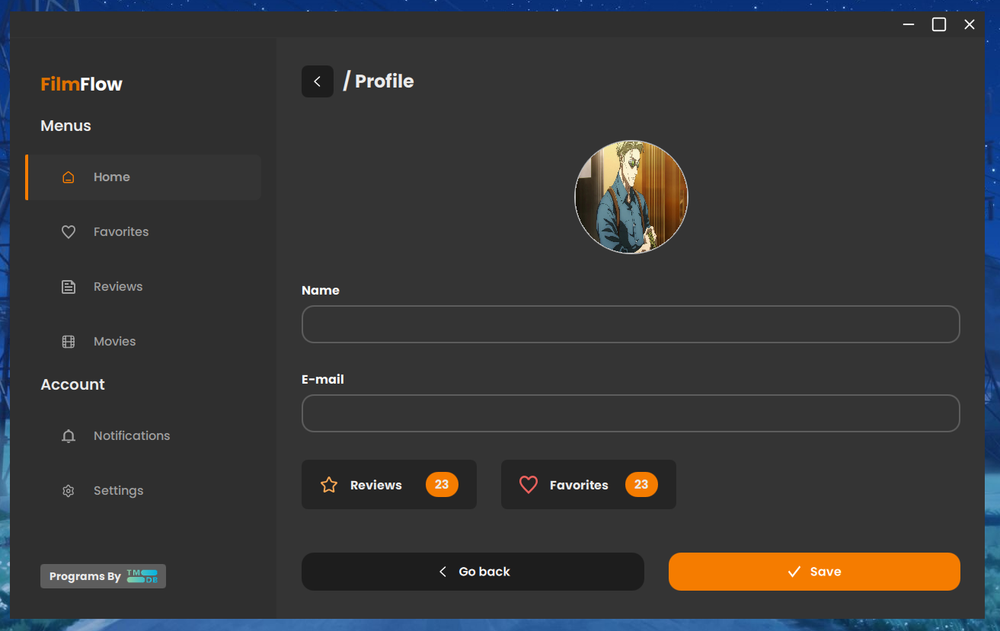
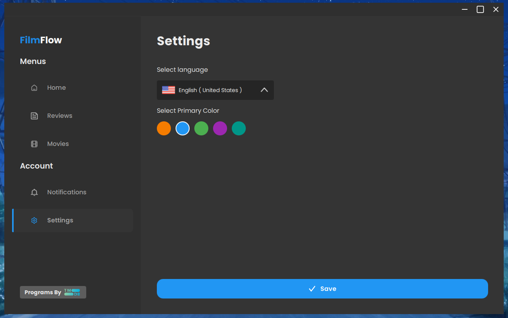
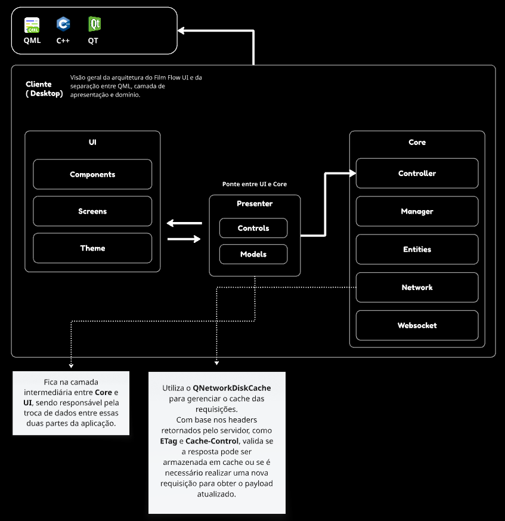

# Film Flow UI

Uma aplicação desktop moderna e elegante para gerenciamento e descoberta de filmes, desenvolvida com Qt/QML. O Film Flow UI oferece uma interface intuitiva para explorar filmes, ler e escrever avaliações, gerenciar favoritos e muito mais.

## Sobre o Projeto

Film Flow UI é uma aplicação multiplataforma construída com Qt 6.5 e QML, proporcionando uma experiência de usuário fluida e responsiva. A aplicação apresenta uma arquitetura modular com separação clara entre lógica de negócio (C++), controles e interface (QML).

## Dependências

### https://github.com/luizh3/film-flow-api

## Funcionalidades

- **Tela Inicial**: Visualize filmes em destaque e recomendações personalizadas
- **Catálogo de Filmes**: Explore uma vasta coleção de filmes organizados por categorias
- **Busca Avançada**: Encontre filmes rapidamente com sistema de busca inteligente
- **Avaliações**: Leia e escreva avaliações detalhadas sobre filmes
- **Notificações**: Receba atualizações sobre novos filmes e interações
- **Perfil**: Gerencie seu perfil e preferências pessoais
- **Configurações**: Personalize a aplicação conforme suas necessidades
- **Favoritos**: Salve seus filmes favoritos para acesso rápido

## Tecnologias

- **Qt 6.5+**: Framework multiplataforma
- **QML/Qt Quick**: Interface declarativa e moderna
- **C++17**: Lógica de negócio e performance
- **CMake**: Sistema de build
- **Qt Quick Controls 2**: Componentes de UI modernos

## Requisitos

- CMake 3.16 ou superior
- Qt 6.5 ou superior
- Compilador C++17 compatível
- Componentes Qt necessários:
  - Qt6::Quick
  - Qt6::QuickControls2
  - Qt6::Qml
  - Qt6::LinguistTools

#### Env variables

- Projects > Build & Run > Run > Environment

| Variável                   | Descrição         | Exemplo                              |
|----------------------------|-------------------|--------------------------------------|
| `FILM_FLOW_API_HOST`       | Host of API       | `http://localhost:3333/api/v1`       |
| `FILM_FLOW_WEBSOCKET_HOST` | Host of Websocket | `127.0.0.1:3333`                     |

## Padrão de Arquitetura

A aplicação segue um padrão **MVP (Model-View-Presenter)** com características de **MVVM**.

| Camada | Implementação |
|--------|---------------|
| **View** | Telas e componentes QML (`ui/screens/`, `ui/components/`) |
| **Presenter/ViewModel** | Controls em C++ (`controls/`) – `MovieControl`, `AuthControl`, etc. |
| **Model** | Controllers, entidades e modelos de lista (`core/`, `ui/models/`) |

Os **Controls** atuam como Presenters: recebem ações da View, orquestram os Controllers, expõem estado via propriedades e emitem sinais. O QML faz binding declarativo nas propriedades dos Controls.

## Estrutura do Projeto

```
film-flow-ui/
├── core/                      # Lógica de negócio e camada de dados
│   ├── controller/            # Controladores de API (AuthController, SectionController, etc.)
│   ├── manager/               # Gerenciadores de aplicação (ApplicationManager, NotificationManager)
│   ├── model/                 # Modelos de domínio
│   │   ├── config/            # Configurações (Configs, ProgramConfig, SectionsConfig)
│   │   ├── entities/          # Entidades (Review, MovieInformation, Session, User, etc.)
│   │   ├── enum/              # Enumeradores
│   │   └── result/            # Resultados de API (PaginationResult, ReviewsResult, etc.)
│   ├── network/               # Camada de rede
│   │   ├── endpoint/          # Endpoints da API
│   │   ├── request/           # Requisições
│   │   └── response/          # Respostas HTTP
│   ├── validator/             # Validadores
│   ├── helper/                # Utilitários (TaskRunHelper, etc.)
│   ├── singleton/             # Singletons (IntegrationManager)
│   └── websocket/             # WebSocket (NotificationWs)
├── controls/                  # Presenters/ViewModels (C++) – bridge entre QML e lógica
├── ui/
│   ├── components/            # Componentes reutilizáveis QML
│   │   ├── elements/          # Elementos base (botões, inputs, ícones, etc.)
│   │   ├── header/            # Cabeçalho
│   │   ├── sidebar/           # Menu lateral
│   │   ├── movieslider/       # Slider de filmes
│   │   ├── cardmovie/         # Card de filme
│   │   └── ...
│   ├── models/                # Modelos para QML (ReviewsListModel, MoviesListModel, etc.)
│   │   ├── mapper/            # Conversão entre entidades e modelos de UI
│   │   └── helper/            # Auxiliares (CardFetchHelper)
│   ├── screens/               # Telas da aplicação
│   │   ├── auth/              # Autenticação
│   │   ├── home/              # Tela inicial
│   │   ├── movie/             # Detalhes do filme
│   │   ├── program/           # Catálogo de programas
│   │   ├── profile/           # Perfil
│   │   ├── review/            # Avaliações
│   │   ├── settings/          # Configurações
│   │   └── ...
│   └── theme/                 # Tema e recursos visuais
│       ├── factory/           # Fábrica de cores
│       ├── manager/           # Gerenciador de tema
│       └── models/            # Modelos de cor
├── documentation/             # Imagens de documentação
├── fonts/                     # Fontes personalizadas (Poppins)
├── i18n/                      # Arquivos de internacionalização
└── resources/                 # Recursos estáticos (ícones, imagens)
```

## Capturas de Tela

### Tela Inicial (Home)
A tela inicial apresenta filmes em destaque, recomendações personalizadas e acesso rápido às principais funcionalidades.



### Catálogo de Filmes
Explore uma vasta coleção de filmes organizados por gênero, popularidade e outros critérios.



### Detalhes do Filme
Visualize informações detalhadas sobre cada filme, incluindo sinopse, elenco, avaliações e muito mais.



### Busca
Sistema de busca avançado que permite encontrar filmes rapidamente por título, gênero ou outros critérios.



### Avaliações
Leia avaliações de outros usuários e compartilhe suas próprias opiniões sobre os filmes.



### Notificações
Mantenha-se atualizado com notificações sobre novos filmes, interações e atualizações importantes.



### Perfil
Gerencie suas informações pessoais, preferências e histórico de atividades.



### Configurações
Personalize a aplicação de acordo com suas preferências, incluindo idioma, tema e outras opções.



## Internacionalização

A aplicação suporta múltiplos idiomas:
- Português (pt_BR)
- Inglês (en_US)
- Espanhol (es_ES)

Atualizar linguist

- Traduzir manualmente

  - lupdate . -ts i18n/*.ts

  - lrelease i18n/*.ts

## Flow



**Desenvolvido usando Qt/QML**
